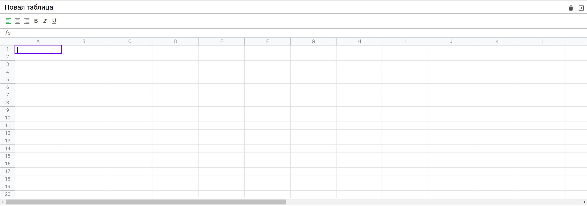

# excel-course : процесс разработки

* Проект построен на ООП в javaScript
* Сборка WebPack + scss
* Состояние Redux + localStorage

## функционал:

* Создание именованных таблиц
* Редактирование + смена стилей шрифта + простой подсчет через поле формула
* Выделение нескольких ячеек
* Удаление таблиц

## скриншот

## пуск:
* старт через npm run start

\
\
\
\
[ссылка на проект](https://interind.github.io/excel-course/)